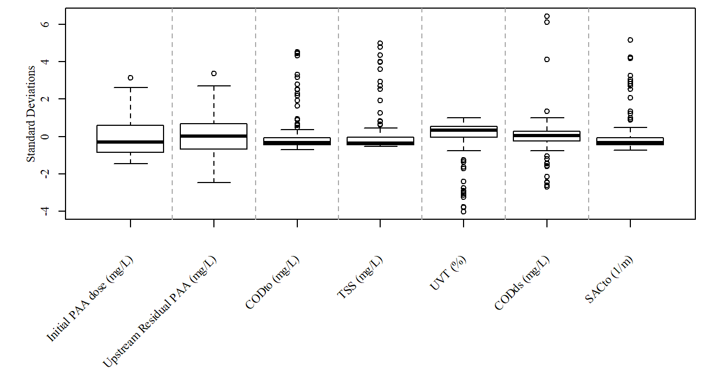
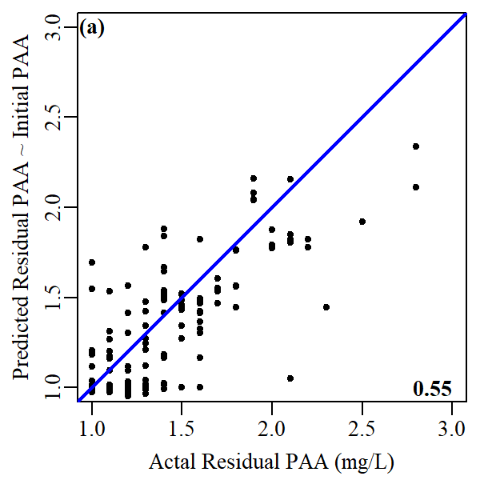
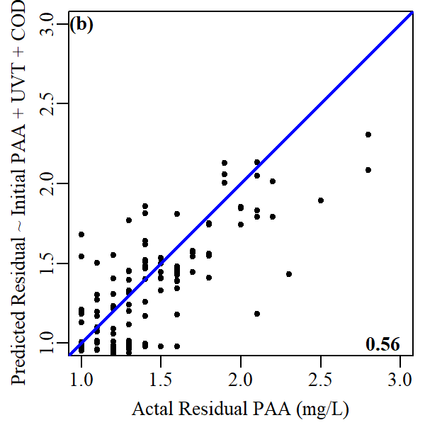
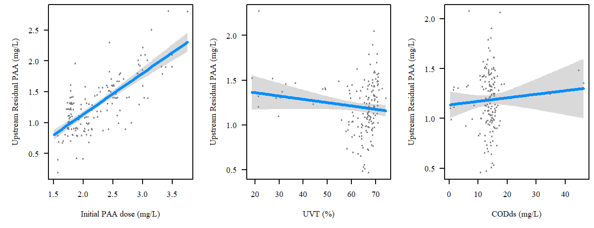
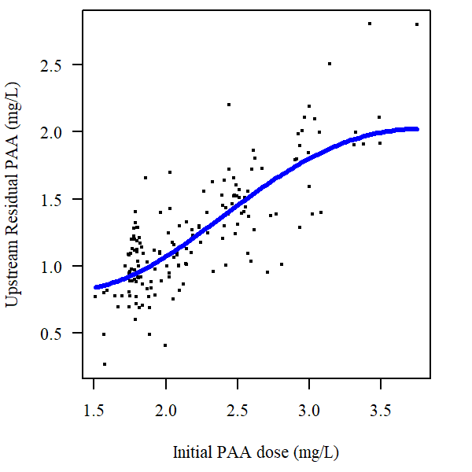

```{r Preliminary declarations, message=FALSE, warning=FALSE, include=FALSE, paged.print=FALSE}
rm(list=ls())

# Load required packages
packageLoad <- function(packName){ #packName - package name as a character string, e.g. "quantmod"
  if(!require(packName,character.only = TRUE)){ #If the package is not available, install it
    install.packages(packName,dependencies=TRUE,repos="http://cran.r-project.org")
  }
  library(packName, character.only = TRUE) # load package
}

sapply(c("knitr", "readxl", "xts", "visreg", "mgcv", "factoextra", "pls", "plsdepot", "ggplot2", "randomForest", "e1071"), function(x) packageLoad(x))

# User-defined functions
windowsFonts(A = windowsFont("Times New Roman"))

default.par <- par()

scaled.boxplot.png <- function(data, filename, lines = seq(round(ncol(data)/5),ncol(data)-1, by = round(ncol(data)/5)) + .5, margins = c(9,3.5,0.5,0.5)+.1) {
  labs <- colnames(data)
  windowsFonts(A = windowsFont("Times New Roman"))
  png(filename, units = "in", res = 200, width = 6.5, height = 3.5, family="A", pointsize = 8)
  par(mar = margins)
  boxplot.data <- sapply(data.frame(data), function(x) scale(na.omit(x)))
  boxplot(boxplot.data, xaxt="n", xlab="")
  axis(1,at=seq(1,length(boxplot.data),by =1), labels = FALSE)
  mtext("Standard Deviations", side = 2, line = 2)
  text(x=seq_along(labs), y=par("usr")[3] - 2, srt=45, adj = 1, labels= labs, xpd=TRUE)
  abline(v=lines, lty = 2,col = "darkgrey")
  dev.off()
  suppressWarnings(par(default.par))
}
```

```{r message=FALSE, warning=FALSE, include=FALSE, paged.print=FALSE}
plotTimeseries <- function(data1) {

label1 <- colnames(data1)

r1 <- range(index(data1)[which(!is.na(data1))])[1]
r2 <- range(index(data1)[which(!is.na(data1))])[2]

data2plot <- na.omit(data1)[paste0(r1,"/",r2)]
data2plot <- data.frame(data2plot, row.names = as.character(index(data2plot)))
data2plot <- cbind(data2plot, as.numeric(difftime(as.POSIXct(rownames(data2plot)), as.POSIXct(rownames(data2plot)[1]),units = "days")))

par(mar=c(3.1,4.1,2.1,2.1))
plot(x = data2plot[,ncol(data2plot)], y = data2plot[,1], type = "p", pch = 20, col = "black", xaxt = "n", xlab = "", ylab = "", yaxt="n")
axis(side = 2)
mtext(side = 2, label1, line = 2.5)

# x-axis
axis.ticks <- seq(0,round(data2plot[nrow(data2plot),ncol(data2plot)]), by = 10)
axis.labels <- sapply(axis.ticks, function(x) which(x > data2plot[,ncol(data2plot)]))
axis.labels <- sapply(axis.labels, function(x) x[length(x)])
axis.labels[[1]] <- 1
axis.labels <- as.numeric(unlist(axis.labels))
axis(side = 1, at = axis.ticks, labels = format(as.POSIXct(rownames(data2plot)[axis.labels]), "%m/%d"))
}

```

```{r message=FALSE, warning=FALSE, include=FALSE, paged.print=FALSE}
plotTwo <- function(data1,data2) {
# data1 <- log(n.paa.grab[,6]) 
# data2 <- nsec.online[,which(colnames(nsec.online) == "NSEC Effluent NO5")]

label1 <- colnames(data1)
label2 <- colnames(data2)

if (range(index(data1)[which(!is.na(data1))])[1] < range(index(data2)[which(!is.na(data2))])[1]) {
  r1 <- range(index(data2)[which(!is.na(data2))])[1]
} else {
  r1 <- range(index(data1)[which(!is.na(data1))])[1]
}
if (range(index(data1)[which(!is.na(data1))])[2] > range(index(data2)[which(!is.na(data2))])[2]) {
  r2 <- range(index(data2)[which(!is.na(data2))])[2]
} else {
  r2 <- range(index(data1)[which(!is.na(data1))])[2]
}

data2plot <- na.omit(data1)[paste0(r1,"/",r2)]
data2plot <- merge(data2plot, data2[paste0(r1,"/",r2)])
data2plot <- data2plot[-which(duplicated(index(data2plot))),]
data2plot <- data.frame(data2plot, row.names = as.character(index(data2plot)))
data2plot <- cbind(data2plot, as.numeric(difftime(as.POSIXct(rownames(data2plot)), as.POSIXct(rownames(data2plot)[1]),units = "days")))

par(mar=c(5.1,4.1,2.1,4.1))
plot(x = data2plot[,3], y = data2plot[,1], type = "p", pch = 20, col = "black", xaxt = "n", xlab = "", ylab = "", yaxt="n")
axis(side = 2)
mtext(side = 2, label1, line = 2.5)

par(new = TRUE)
plot(x = data2plot[,3], y = data2plot[,2], type = "p", pch = 20, col = "red", xaxt = "n", xlab = "", yaxt="n", ylab = "")
axis(side = 4, col.axis = "red")
mtext(side = 4, label2, line = 2.5, col = "red")
# x-axis
axis.ticks <- seq(0,round(data2plot[nrow(data2plot),3]), by = 10)
axis.labels <- sapply(axis.ticks, function(x) which(x > data2plot[,3]))
axis.labels <- sapply(axis.labels, function(x) x[length(x)])
axis.labels[[1]] <- 1
axis.labels <- as.numeric(unlist(axis.labels))
axis(side = 1, at = axis.ticks, labels = format(as.POSIXct(rownames(data2plot)[axis.labels]), "%m/%d"))
}
```

# Introduction
The Robert W. Hite Treatment Facility, operated by the Metro Wastewater Reclamation District (MWRD) of Denver, CO, treats ~130 million gallons per day (MGD) of wastewater produced by ~2 million people from the Denver-metro area and is the largest wastewater treatment facility in the Rocky Mountain west. In an effort to reduce the cost of disinfection, a peracetic acid (PAA) system was installed to replace the existing chloramine system. However, due to variable influent *E. coli* concentrations to the disinfection system, it has been difficult to optimize the dosing of PAA to keep below *E. coli* limits of 126 (most probable number [MPN])/100 mL based on a 30-day geometric mean and 252 MPN/100 mL based on a 7-day geometric mean. In practice, PAA is overdosed to ensure that MWRD is meeting it's discharge limit. The goal of this work is to identify correlations between upstream operating conditions in the secondary activated sludge system, *E. coli* concentrations, and PAA dosing. 

# Goals
Design a PAA disinfection dosing system that accounst for:

<div custom-style="Bullets">
* Upstream secondary treatment performance
* Flowrate through the disinfection basin (i.e., hydraulic retention time or HRT)
* Flow conditions in receiving water body (e.g., low, mid-range, high, dry, moist)
</div>

<!-- 491 Giga-CFU/day for Mid-Range Flows, 540 Giga-CFU/day for moist conditions, and 624 Giga-CFU/day for high flows. The TMDL states These load requirements will be implemented by setting effluent -->

# Questions
<div custom-style="Numbered">
1. What effects pre-disinifection *E. coli*?
2. What effects PAA disinfection efficiency?
</div>

<!-- V1 -->
```{r NSEC Online, eval=FALSE, message=FALSE, warning=FALSE, include=FALSE, paged.print=FALSE}
## North secondary online
nsec.online <- as.data.frame(suppressWarnings(read_excel("data/North Secondary and Disinfection Process Data_20190215.xlsx", sheet = "NSEC Online Data", col_names = FALSE,
    col_types = c("date", "numeric", "numeric", 
        "numeric", "numeric", "numeric", 
        "numeric", "numeric", "numeric", 
        "numeric", "numeric", "numeric", 
        "numeric", "numeric", "numeric", 
        "numeric", "numeric", "numeric", 
        "numeric", "numeric", "numeric", 
        "numeric", "numeric", "numeric", 
        "numeric", "numeric", "numeric", 
        "numeric", "numeric", "numeric", 
        "numeric", "numeric", "numeric", 
        "numeric", "numeric", "numeric"), 
    skip = 4)))
nsec.online <- xts(nsec.online[,-1], order.by = nsec.online[,1])
colnames(nsec.online) <- c("NSEC Influent Flow", "NSEC Influent Temp","NSEC Influent NH3","NSEC Influent TSS","NSEC Influent COD",
                           "NSEC CaRRB-1 Centrate Flow","NSEC CaRRB-1 NH3","NSEC CaRRB-3 Centrate Flow","NSEC CaRRB-3 NH3",
                           "GTE Flow","GTE to SSEC Flow","GTE to NSEC Flow",
                           "AB-10 Influent Flow","AB-10 A-Pass Temp","AB-10 A-Pass pH","AB-10 A-Pass DO","AB-10 A-Pass NH3","AB-10 A-Pass NO3","AB-10 B-Pass DO","AB-10 C-Pass pH	AB-10","C-Pass DO","AB-10 C-Pass NH3","AB-10 C-Pass NO3","AB-10 MLSS","AB-10 MLR Flow","Quad 4 RAS Flow","Quad 4 Basins in Service","AB-10 RAS Flow","NSEC Aerobic SRT",
                           "NSEC Effluent NH3","NSEC Effluent NO3","NSEC Effluent OP","NSEC Effluent TSS","NSEC Effluent NO5","NSEC Effluent Flow")


# cols <- c("NSEC Influent Flow", "NSEC Influent Temp","NSEC Influent NH3","NSEC Influent TSS","NSEC Influent COD")
# n <- as.numeric(sapply(cols, function(x) which(colnames(nsec.online) == x)))
# north.secondary.influent <- nsec.online[,n]
# 
# cols <- c("AB-10 Influent Flow","AB-10 A-Pass Temp","AB-10 A-Pass pH","AB-10 A-Pass DO","AB-10 A-Pass NH3","AB-10 A-Pass NO3","AB-10 B-Pass DO","AB-10 C-Pass pH	AB-10","C-Pass DO","AB-10 C-Pass NH3","AB-10 C-Pass NO3","AB-10 MLSS","AB-10 MLR Flow","Quad 4 RAS Flow","Quad 4 Basins in Service","AB-10 RAS Flow", "NSEC Aerobic SRT")
# n <- as.numeric(sapply(cols, function(x) which(colnames(nsec.online) == x)))
# north.secondary <- nsec.online[,n]
# 
# cols <- c("NSEC CaRRB-1 Centrate Flow","NSEC CaRRB-1 NH3","NSEC CaRRB-3 Centrate Flow","NSEC CaRRB-3 NH3")
# n <- as.numeric(sapply(cols, function(x) which(colnames(nsec.online) == x)))
# north.secondary.carrb <- nsec.online[,n]
# 
# cols <- c("GTE Flow","GTE to SSEC Flow","GTE to NSEC Flow")
# n <- as.numeric(sapply(cols, function(x) which(colnames(nsec.online) == x)))
# north.secondary.gte <- nsec.online[,n]
# 
# cols <- c("NSEC Effluent NH3","NSEC Effluent NO3","NSEC Effluent OP","NSEC Effluent TSS","NSEC Effluent NO5","NSEC Effluent Flow")
# n <- as.numeric(sapply(cols, function(x) which(colnames(nsec.online) == x)))
# north.secondary.effluent <- nsec.online[,n]

# sapply(nsec.online, function(x) plot(x, main = colnames(x)))
# scaled.boxplot.png(nsec.online, "figures/MWRD_nsec_online_boxplots_01.png")

# Remove outliers, such as negative flows, unrealistic sensor values, and missing values (Influnet COD/TSS, effluent NO5)
nsec.online$`NSEC Influent Flow`[which(nsec.online$`NSEC Influent Flow` < 0)] <- 0 # Remove negative values
nsec.online$`NSEC Influent NH3`[which(nsec.online$`NSEC Influent NH3` > 100)] <- 100 # Sensor error
nsec.online <- nsec.online["2018-01-16/2018-12-01"] # NSEC Influent COD and TSS values stop after December 1st
nsec.online <- nsec.online["2018-06-01/2018-12-01"] # Effluent NO5 invalid prior to June
nsec.online$`NSEC Effluent TSS`[which(nsec.online$`NSEC Effluent TSS` < 0)] <- 0 # Remove negative values
nsec.online$`NSEC Effluent NO5`[which(nsec.online$`NSEC Effluent NO5` <55)]

# scaled.boxplot.png(nsec.online, "figures/MWRD_nsec_online_boxplots_02.png")


# nsec.online <- nsec.online["2018-11-04/2018-12-01"]
cols2remove <- c("NSEC CaRRB-1 Centrate Flow","NSEC CaRRB-1 NH3","NSEC CaRRB-3 Centrate Flow","NSEC CaRRB-3 NH3","GTE Flow","GTE to SSEC Flow","GTE to NSEC Flow")

data2plot <- nsec.online[,-sapply(cols2remove, function(x) which(colnames(nsec.online) == x))]
# sapply(data2plot, function(x) plot.xts(na.omit(x), main = colnames(x), grid.col = NA, yaxis.right = FALSE, format.labels ="%m/%d"))


# Create boxplots
# labs <- colnames(nsec.online)
# windowsFonts(A = windowsFont("Times New Roman"))
# png("MWRD_nsec_online_boxplots.png", units = "in", res = 200, width = 2*6.5, height = 2*4, family="A", pointsize = 16)
# par(mar = c(9,3.5,.5,.5)+.1)
# boxplot.data <- sapply(data.frame(nsec.online), function(x) scale(na.omit(x)))
# boxplot(boxplot.data, xaxt="n", xlab="")
# axis(1,at=seq(1,length(boxplot.data),by =1), labels = FALSE)
# mtext("Standard Deviations", side = 2, line = 2)
# text(x=seq_along(labs), y=par("usr")[3] - 2, srt=45, adj = 1, labels= labs, xpd=TRUE)
# abline(v=c(5.5,10.5,15.5,20.5,25.5,30.5), lty = 2,col = "darkgrey")
# dev.off()
# scaled.boxplot.png(nsec.online, "figures/MWRD_nsec_online_boxplots.png")
```

```{r NPAA Online, message=FALSE, warning=FALSE, include=FALSE, paged.print=FALSE}
# ## North disinfection online
# Because the PAA analyzers stop functioning ater July 1st, the dataset is concatenated. Also, PAA analyzer CL17-1 appears to have more outliers, but CL17-2 has more noise. Both will be analyzed for prediction accuracy before determining which will be used for modelling. 
n.paa.online <- as.data.frame(read_excel("data/North Secondary and Disinfection Process Data_20190215.xlsx", 
    sheet = "North PAA Online Data", col_names = FALSE, 
    col_types = c("date", "numeric", "numeric","numeric","numeric","numeric","numeric","numeric","numeric"), skip = 3))
colnames(n.paa.online) <- c("Date", "North PAA Upstream Residual (CL17-1)", "North PAA Upstream Residual (CL17-2)", "North PAA Upstream Residual",
                            "North PAA Dosing Pump Flow", "North PAA Dose Setpoint", "North PAA HRT", "North PAA CT Target Dose", "North Disinfection Flow")


n.paa.online <- xts(n.paa.online[,-1], order.by = n.paa.online[,1])

# Plot all original data
data2plot <- n.paa.online[,-3]
# sapply(data2plot, function(x) plot.xts(na.omit(x), main = colnames(x), grid.col = NA, yaxis.right = FALSE, format.labels ="%m/%d"))
# scaled.boxplot.png(n.paa.online, "figures/MWRD_npaa_online_boxplots_01.png", margins = c(13,6.5,0.5,0.5)+.1)
# Subset to only include times when PAA analyzers CL17-1 & CL17-2 are online
n.paa.online <- n.paa.online["2018-01-16/2018-07-01"]
# Subset to only include costant PAA setpoint
# n.paa.online <- n.paa.online[which(n.paa.online$`North PAA Dose Setpoint` < 1.200001),]
# scaled.boxplot.png(n.paa.online, "figures/MWRD_npaa_online_boxplots_02.png", margins = c(13,6.5,0.5,0.5)+.1)
# Compare PAA analyzers
# par(mfrow=(c(2,1)))
# plot(n.paa.online[,1], main = colnames(n.paa.online)[1])
# plot(n.paa.online[,2], main = colnames(n.paa.online)[2])
# par(default.par)
# plot.xts(n.paa.online[,1:2], type = "p", pch = 20, cex = 0.8,  col = c("black", "red"), grid.col = NA, main = NA, yaxis.right = FALSE, legend.loc = "topleft", format.labels ="%m/%d", minor.ticks = NULL)

# Create boxplots
# scaled.boxplot.png(n.paa.online, "figures/MWRD_npaa_online_boxplots.png", margins = c(13,6.5,0.5,0.5)+.1)
```

<!-- V1 -->
```{r NPAA Grab, message=FALSE, warning=FALSE, include=FALSE, paged.print=FALSE}
## North disinfection - grab
delta <- intToUtf8(0x0394)
# Daily data
process.data <- read_excel("data/Copy of PAA Process Data Clean KN.xlsx", 
    sheet = "Process Data", skip = 1)
process.data <- process.data[-1,]
n.paa.grab <- xts(apply(process.data[,c(12:17,19:27)], 2, function(x) as.numeric(x)), order.by =  as.POSIXct(as.data.frame(process.data[,18])[,1], format = "%Y-%m-%d %H:%M:%S"))
colnames(n.paa.grab) <- c("PAA Dosing Pump Total Flow (gpm)", #1 
                                  "PAA Dose (mg/L)", #2
                                  "PAA Setpoint (mg/L)", #3 
                                  "Upstream  Residual (mg/L)", #4 
                                  paste0(delta,"PAA (mg/L)"),	#5
                                  "Pre-Disinfection E. coli (MPN/100 mL)",  #6
                                  "Effluent Discharge (MGD)", #7
                                  "Contact Tank Volume (MG)", #8
                                  "Detention Time (min)", #9
                                  "Time to Upstream Sample Point (min)", #10
                                  "Log Removal (N0/N)", #11
                                  "Effluent E. coli (MPN/100 mL)", #12
                                  "CT (mg/L*min)", #13
                                  "CuT (mg/L*min)", #14
                                  "Ambient Temperature")#15
rm(process.data)

# scaled.boxplot.png(n.paa.grab, "figures/MWRD_npaa_grab_boxplots_01.png", margins = c(12,6.5,0.5,0.5)+.1)

n.paa.grab <- n.paa.grab["2018-06-01/2018-12-01"]
n.paa.grab <- n.paa.grab[-which(n.paa.grab[,4] > 4),] # Remove high PAA residuals

data2plot <- n.paa.grab
data2plot[,6] <- log(data2plot[,6])
colnames(data2plot)[6] <- paste("LOG",colnames(data2plot)[6])
data2plot[,12] <- log(data2plot[,12])
colnames(data2plot)[12] <- paste("LOG",colnames(data2plot)[12])
sapply(data2plot, function(x) plot.xts(na.omit(x), main = colnames(x), grid.col = NA, yaxis.right = FALSE, format.labels ="%m/%d"))

# par(default.par)
# plot.xts(data2plot[,c(6,12)], type = "p", pch = 20, cex = 0.8,  col = c("black", "red"), grid.col = NA, main = NA, yaxis.right = FALSE, legend.loc = "bottomleft", format.labels ="%m/%d", minor.ticks = NULL)

# scaled.boxplot.png(n.paa.grab, "figures/MWRD_npaa_grab_boxplots_02.png", margins = c(12,6.5,0.5,0.5)+.1)
# Create boxplots
# scaled.boxplot.png(n.paa.grab, "figures/MWRD_npaa_grab_boxplots.png", margins = c(12,6.5,0.5,0.5)+.1)
```

<!-- V1 -->
```{r Merge NSEC/NPAA, eval=FALSE, message=FALSE, warning=FALSE, include=FALSE, paged.print=FALSE}
# Combine Pre. disinfection *E. coli* with North secondary effluent parameters
data1 <- nsec.online
# # From PCA analysis, these variables do not impact PC1 (i.e., E.coli) and are only present on PC2
# cols2remove <- c("GTE Flow", "AB-10 MLSS",
#                  "NSEC CaRRB-3 Centrate Flow",
#                  "NSEC CaRRB-1 Centrate Flow",
#                  "NSEC Influent COD", 
#                  "NSEC Influent Flow", "NSEC Influent Temp", "NSEC Influent NH3", "NSEC Influent TSS")
# cols2remove <- sapply(cols2remove, function(x) which(colnames(data1) == x))
# data1 <- data1[,-cols2remove]
cols2keep <- c("NSEC Aerobic SRT", "NSEC Effluent NH3", "NSEC Effluent OP", "NSEC Effluent NO3","NSEC Effluent TSS","NSEC Effluent NO5",
               "NSEC Influent Flow","NSEC Effluent Flow", "AB-10 Influent Flow", "AB-10 RAS Flow", "AB-10 MLR Flow", "Quad 4 RAS Flow")
data1 <- data1[,cols2keep]

# During initial analysis, a log transformation of pre-disinfection *E. coli* was found to improve the results of PCA, PLS, and GAM modeling. 
data2 <- log(n.paa.grab[,6])

label1 <- colnames(data1)
label2 <- colnames(data2)

all.data <- merge(data2, data1)
all.data.index <- which(!is.na(all.data[,1]))
for(i in 1:(length(all.data.index)-1)) {
    row.start <- all.data.index[i]
    row.stop <- all.data.index[i+1]
    data.locf <- na.locf(all.data[(row.start+1):row.stop,])
    if (i == 1) {
        new.data <- data.frame(data.locf[nrow(data.locf),])
    }
    if (i != 1) {
        new.data <- rbind(new.data, data.frame(data.locf[nrow(data.locf),]))
    }
}
#new.data <- new.data[which(!is.na(new.data[,2])),-which(is.na(new.data[1,]))]

colnames(new.data) <- c("Pre-disinf E. coli (LOG MPN/100mL)", cols2keep)

new.data <- na.omit(new.data)

nsec.online.ecoli.data <- new.data
scaled.boxplot.png(nsec.online.ecoli.data[,-1], "MWRD_nsec_online_boxplots_03.png", margins = c(7.5,4.5,0.5,0.5)+.1)
scaled.boxplot.png(nsec.online.ecoli.data[,-1], "MWRD_Ecoli_nseconline_boxplots.png", margins = c(7.5,4.5,0.5,0.5)+.1)
```

<!-- V1 -->
```{r Vis/Ecoli, eval=FALSE, message=FALSE, warning=FALSE, include=FALSE, paged.print=FALSE}
# Add Vis data?
vis.data <- read_excel("data/NNE Carbovis Data2.xlsx",
    sheet = "Inst DL Data", col_types = c("date",
        "text", "numeric", "skip", "skip",
        "skip", "numeric", "skip", "skip",
        "skip", "numeric", "skip", "skip",
        "skip", "numeric", "skip", "skip",
        "skip", "numeric", "skip", "skip",
        "skip", "numeric", "skip", "skip",
        "skip", "skip", "numeric", "skip",
        "skip", "skip", "numeric", "skip",
        "skip", "skip", "skip", "numeric",
        "skip", "skip", "skip", "numeric",
        "skip"), skip = 6)
vis.data <- vis.data[which(vis.data[,2] == "Valid"),-2]
colnames(vis.data) <- c("Time", "CODto (mg/L)", "CODto (V)",
                        "TSS (mg/L)", "TSS (V)",
                        "UVT (%)", "UVT (V)",
                        "CODds (mg/L)", "CODds (V)",
                        "SACto (1/m)", "SACto (V)")
vis.data <- xts(vis.data[,-1], order.by = as.POSIXct(as.data.frame(vis.data[,1])[,1], format = "%Y-%m-%d %H-%M-%S"))

# Combine Pre. disinfection *E. coli* with North Carbovis parameters
data1 <- vis.data
# # From PCA analysis, these variables do not impact PC1 (i.e., E.coli) and are only present on PC2
# cols2remove <- c("GTE Flow", "AB-10 MLSS",
#                  "NSEC CaRRB-3 Centrate Flow",
#                  "NSEC CaRRB-1 Centrate Flow",
#                  "NSEC Influent COD", 
#                  "NSEC Influent Flow", "NSEC Influent Temp", "NSEC Influent NH3", "NSEC Influent TSS")
# cols2remove <- sapply(cols2remove, function(x) which(colnames(data1) == x))
# data1 <- data1[,-cols2remove]
# cols2keep <- c("NSEC Aerobic SRT", "NSEC Effluent NH3", "NSEC Effluent OP", "NSEC Effluent NO3","NSEC Effluent TSS","NSEC Effluent NO5",
#                "NSEC Influent Flow","NSEC Effluent Flow", "AB-10 Influent Flow", "AB-10 RAS Flow", "AB-10 MLR Flow", "Quad 4 RAS Flow")
# data1 <- data1[,cols2keep]

# During initial analysis, a log transformation of pre-disinfection *E. coli* was found to improve the results of PCA, PLS, and GAM modeling. 
data2 <- log(n.paa.grab[,6])

label1 <- colnames(data1)
label2 <- colnames(data2)

all.data <- merge(data2, data1)
all.data.index <- which(!is.na(all.data[,1]))
for(i in 1:(length(all.data.index)-1)) {
    row.start <- all.data.index[i]
    row.stop <- all.data.index[i+1]
    data.locf <- na.locf(all.data[(row.start+1):row.stop,])
    if (i == 1) {
        new.data <- data.frame(data.locf[nrow(data.locf),])
    }
    if (i != 1) {
        new.data <- rbind(new.data, data.frame(data.locf[nrow(data.locf),]))
    }
}
#new.data <- new.data[which(!is.na(new.data[,2])),-which(is.na(new.data[1,]))]
new.data <- na.omit(new.data)

vis.ecoli.data <- xts(new.data, order.by = as.POSIXct(rownames(new.data)))

colnames(vis.ecoli.data) <- c("Pre-disinf E. coli (LOG MPN/100mL)", "CODto (mg/L)", "CODto (V)",
                        "TSS (mg/L)", "TSS (V)",
                        "UVT (%)", "UVT (V)",
                        "CODds (mg/L)", "CODds (V)",
                        "SACto (1/m)", "SACto (V)")

cols2remove <- c("CODto (V)","TSS (V)","UVT (V)","CODds (V)","SACto (V)")
cols2remove <- sapply(cols2remove, function(x) which(colnames(vis.ecoli.data) == x))
vis.ecoli.data <- vis.ecoli.data[,-cols2remove]

scaled.boxplot.png(vis.ecoli.data[,-1], "MWRD_Ecoli_vis_boxplots.png", margins = c(8,4.5,0.5,0.5)+.1)

# # From plots, only truly "clean" data is is June and December
# vis.ecoli.data.june <- vis.ecoli.data["2018-06-01/2018-06-30"]
# vis.ecoli.data.dec <- vis.ecoli.data["2018-12-01/2018-12-31"]

# pdf("MWRD_Ecoli_vis_timeseries.pdf", paper = "letter")
# # png("MWRD_Ecoli_vis_timeseries.png")
# par(mfrow=c(4,1))
# for(i in 1:ncol(vis.ecoli.data.dec)) {
#   plotTimeseries(vis.ecoli.data.dec[,i])
# }
# dev.off()
# plotTwo(vis.ecoli.data.dec[,1], vis.ecoli.data.dec[,5])
```

<!-- V2 -->
```{r Vis/PAA, message=FALSE, warning=FALSE, include=FALSE, paged.print=FALSE}
# Add Vis data?
vis.data <- read_excel("data/NNE Carbovis Data2.xlsx",
    sheet = "Inst DL Data", col_types = c("date",
        "text", "numeric", "skip", "skip",
        "skip", "numeric", "skip", "skip",
        "skip", "numeric", "skip", "skip",
        "skip", "numeric", "skip", "skip",
        "skip", "numeric", "skip", "skip",
        "skip", "numeric", "skip", "skip",
        "skip", "skip", "numeric", "skip",
        "skip", "skip", "numeric", "skip",
        "skip", "skip", "skip", "numeric",
        "skip", "skip", "skip", "numeric",
        "skip"), skip = 6)
vis.data <- vis.data[which(vis.data[,2] == "Valid"),-2]
colnames(vis.data) <- c("Time", "CODto (mg/L)", "CODto (V)",
                        "TSS (mg/L)", "TSS (V)",
                        "UVT (%)", "UVT (V)",
                        "CODds (mg/L)", "CODds (V)",
                        "SACto (1/m)", "SACto (V)")
vis.data <- xts(vis.data[,-1], order.by = as.POSIXct(as.data.frame(vis.data[,1])[,1], format = "%Y-%m-%d %H-%M-%S"))

vis.data <- vis.data[-which(vis.data$`CODds (mg/L` == 0),] # Remove sensor error
vis.data <- vis.data[-which(vis.data$`CODto (mg/L` > 200),] # Remove bad COD data


# Combine Pre. disinfection *E. coli* with North Carbovis parameters
data1 <- vis.data
# # From PCA analysis, these variables do not impact PC1 (i.e., E.coli) and are only present on PC2
# cols2remove <- c("GTE Flow", "AB-10 MLSS",
#                  "NSEC CaRRB-3 Centrate Flow",
#                  "NSEC CaRRB-1 Centrate Flow",
#                  "NSEC Influent COD", 
#                  "NSEC Influent Flow", "NSEC Influent Temp", "NSEC Influent NH3", "NSEC Influent TSS")
# cols2remove <- sapply(cols2remove, function(x) which(colnames(data1) == x))
# data1 <- data1[,-cols2remove]
# cols2keep <- c("NSEC Aerobic SRT", "NSEC Effluent NH3", "NSEC Effluent OP", "NSEC Effluent NO3","NSEC Effluent TSS","NSEC Effluent NO5",
#                "NSEC Influent Flow","NSEC Effluent Flow", "AB-10 Influent Flow", "AB-10 RAS Flow", "AB-10 MLR Flow", "Quad 4 RAS Flow")
# data1 <- data1[,cols2keep]

# Import PAA data
data2 <- n.paa.grab[,c(2,4)] # PAA dose (calculated), Upstream residual

label1 <- colnames(data1)
label2 <- colnames(data2)

all.data <- merge(data2, data1)
all.data.index <- which(!is.na(all.data[,1]))
for(i in 1:(length(all.data.index)-1)) {
    row.start <- all.data.index[i]
    row.stop <- all.data.index[i+1]
    data.locf <- na.locf(all.data[(row.start+1):row.stop,])
    if (i == 1) {
        new.data <- data.frame(data.locf[nrow(data.locf),])
    }
    if (i != 1) {
        new.data <- rbind(new.data, data.frame(data.locf[nrow(data.locf),]))
    }
}
#new.data <- new.data[which(!is.na(new.data[,2])),-which(is.na(new.data[1,]))]
new.data <- na.omit(new.data)

vis.paa.data <- xts(new.data, order.by = as.POSIXct(rownames(new.data)))

colnames(vis.paa.data) <- c("Initial PAA dose (mg/L)", "Upstream Residual PAA (mg/L)", "CODto (mg/L)", "CODto (V)",
                        "TSS (mg/L)", "TSS (V)",
                        "UVT (%)", "UVT (V)",
                        "CODds (mg/L)", "CODds (V)",
                        "SACto (1/m)", "SACto (V)")

cols2remove <- c("CODto (V)","TSS (V)","UVT (V)","CODds (V)","SACto (V)")

cols2remove <- sapply(cols2remove, function(x) which(colnames(vis.paa.data) == x))
vis.paa.data <- vis.paa.data[,-cols2remove]


scaled.boxplot.png(vis.paa.data[,-1], "figures/MWRD_paa_vis_boxplots.png", margins = c(11,4.5,0.5,0.5)+.1)

# # From plots, only truly "clean" data is is June and December
# vis.ecoli.data.june <- vis.ecoli.data["2018-06-01/2018-06-30"]
# vis.ecoli.data.dec <- vis.ecoli.data["2018-12-01/2018-12-31"]

# pdf("MWRD_Ecoli_vis_timeseries.pdf", paper = "letter")
# # png("MWRD_Ecoli_vis_timeseries.png")
# par(mfrow=c(4,1))
# for(i in 1:ncol(vis.ecoli.data.dec)) {
#   plotTimeseries(vis.ecoli.data.dec[,i])
# }
# dev.off()
# plotTwo(vis.ecoli.data.dec[,1], vis.ecoli.data.dec[,5])
```
<div custom-style="FigureCenter">

</div>

**Figure 1.** Scaled boxplot of online PAA data and Carbovis data. 

# Methods

## Linear regression
In simple linear regression, a model is constructed of a response variable (**Y**) that is a linear function of other variables (*x~i~*). The linear regression model assumes that **Y** is normally distributed, errors are normally distributed and independent, and **X** has constant variance. 
<!-- V2 -->
```{r message=FALSE, warning=FALSE, include=FALSE, paged.print=FALSE}
data <- data.frame(vis.paa.data)
lm <- lm(Upstream.Residual.PAA..mg.L. ~ Initial.PAA.dose..mg.L.,data = data)

xmax <- 3
ymin <- 1
png("figures/MWRD_residual_paa_lm.png", units = "in", res = 200, width = 3, height = 3, family="A", pointsize = 10)
par(mar=c(3,3,.5,.5), mgp=c(1.75,.5,0))
plot(x = data[,2], y = fitted(lm), 
     xlim=c(ymin,xmax), ylim=c(ymin,xmax),
     xlab="Actal Residual PAA (mg/L)", ylab="Predicted Residual PAA ~ Initial PAA", pch=20)
abline(a=0,b=1,col="blue", lwd=2)
text(xmax,y=ymin,labels=round(summary.lm(lm)$r.squared,2), font=2, adj = 1)
text(x=ymin,y=xmax,labels="(a)", font=2)
dev.off()


data <- data.frame(vis.paa.data)
fmla <- as.formula(paste0(colnames(data)[2],"~", paste(colnames(data)[c(1,3:length(colnames(data)))], collapse= "+"))) # All variables
fmla <- as.formula(paste0(colnames(data)[2],"~", paste(c("Initial.PAA.dose..mg.L.","UVT....","CODds..mg.L."), collapse= "+"))) # Just sig vars
lm <- lm(fmla, data = data)

xmax <- 3
ymin <- 1
png("figures/MWRD_residual_lm.png", units = "in", res = 200, width = 3, height = 3, family="A", pointsize = 10)
par(mar=c(3,3,.5,.5), mgp=c(1.75,.5,0))
plot(x = data[,2], y = fitted(lm), 
     xlim=c(ymin,xmax), ylim=c(ymin,xmax),
     xlab="Actal Residual PAA (mg/L)", ylab="Predicted Residual ~ Initial PAA + UVT + CODds", pch=20)
abline(a=0,b=1,col="blue", lwd=2)
text(xmax,y=ymin,labels=round(summary.lm(lm)$r.squared,2), font=2, adj = 1)
text(x=ymin,y=xmax,labels="(b)", font=2)
dev.off()
```
<div custom-style="FigureCenter">


</div>
**Figure 2.** Linear model fit for upstream residual PAA given (a) the initial dosing concentration of PAA and (b) the initial dosing concentration of PAA, UV transmitance, and CODds. Black circles represent actual observations. Blue line represents a perfect model fit. R-squared value in lower right. Figures show a strong relationship between initial PAA dose and the upstream residual, but linear impacts of other online water quality variables are minimal. Ambient temperature was originally included, but did not provide any model fit benefit. 


## Generalized Linear Model
The general linear model (LM) requires that the response variable follows the normal distribution whilst the generalized linear model (GLM) is an extension of the LM that allows the specification of models whose response variable follows different distributions. 
No difference was found between a LM fit with the initial calculated PAA dose, UVT, and CODds and a GLM fit with the same predictor variables. 

<!-- V2 -->
```{r GLM, message=FALSE, warning=FALSE, include=FALSE, paged.print=FALSE}
data <- data.frame(vis.paa.data)
# fmla <- as.formula(paste0(colnames(data)[2],"~", paste(colnames(data)[c(1,3:length(colnames(data)))], collapse= "+")))
fmla <- as.formula(paste0(colnames(data[2]),"~", paste(c("Initial.PAA.dose..mg.L.", "UVT....", "CODds..mg.L."), collapse="+")))
glm.vis.paa.data <- glm(fmla, data=data)

png("figures/MWRD_residual_vis_glm.png", units = "in", res = 200, width = 6.5, height = 2.5, family="A", pointsize = 10)
par(mar=c(5,5,.5,.5), mfrow=c(1, 3))
visreg::visreg(glm.vis.paa.data, "Initial.PAA.dose..mg.L.", ylab="Upstream Residual PAA (mg/L)", xlab = "Initial PAA dose (mg/L)")
visreg::visreg(glm.vis.paa.data, "UVT....", ylab="Upstream Residual PAA (mg/L)", xlab = "UVT (%)")
visreg::visreg(glm.vis.paa.data, "CODds..mg.L.", ylab="Upstream Residual PAA (mg/L)", xlab = "CODds (mg/L)")
dev.off()

xmax <- 3
ymin <- 1
png("figures/MWRD_residual_glm.png", units = "in", res = 200, width = 3, height = 3, family="A", pointsize = 10)
par(mar=c(3,3,.5,.5), mgp=c(1.75,.5,0))
plot(x = data[,2], y = glm.vis.paa.data$fitted.values, 
     xlim=c(ymin,xmax), ylim=c(ymin,xmax),
     xlab="Actal Residual PAA (mg/L)", ylab="Predicted Residual ~ Initial PAA + UVT + CODds", pch=20)
abline(a=0,b=1,col="blue", lwd=2)
# text(xmax,y=ymin,labels=round(summary.lm(lm)$r.squared,2), font=2, adj = 1)
# text(x=ymin,y=xmax,labels="(b)", font=2)
dev.off()
```
<div custom-style="FigureCenter">

</div>
**Figure 3.** GLM model constructed for upstream residual PAA concentration (mg/L) calculated from initial calculated PAA dose, UVT, and CODds.


## Non-Regression Model
```{r Random Forest and SVM, message=FALSE, warning=FALSE, include=FALSE, paged.print=FALSE}
par(default.par)
# 
# rf.nsec.online.ecoli <- randomForest::randomForest(Pre.disinf.E..coli..LOG.MPN.100mL. ~ NSEC.Aerobic.SRT + NSEC.Effluent.OP + NSEC.Effluent.NO3 + NSEC.Effluent.NO5 + NSEC.Effluent.Flow, data=data.frame(nsec.online.ecoli.data))

data <- data.frame(vis.paa.data)
fmla <- as.formula(paste0(colnames(data)[2],"~", paste(colnames(data)[c(1,3:length(colnames(data)))], collapse= "+")))
svm.test <- e1071::svm(fmla, data = data)

png("figures/MWRD_residual_svm.png", units = "in", res = 200, width = 3, height = 3, family="A", pointsize = 8)
par(mfrow=c(1,1), mar=c(4.5,4,.5,2))

visreg(fit=svm.test, xvar="Initial.PAA.dose..mg.L.", plot=TRUE, xlab = "Initial PAA dose (mg/L)", ylab = "Upstream Residual PAA (mg/L)", points.par=c(col="black"), line.par=c(col="blue"))
dev.off()

```
<div custom-style="FigureCenter">

</div>

**Figure 4.** Nonregression model (support vector machine) for predicting upstream residual PAA shows a nonlinear behavior

```{r eval=FALSE, message=FALSE, warning=FALSE, include=FALSE, paged.print=FALSE}
knitr::kable(pca.vis.ecoli.summary$contrib, digits = 2)
# factoextra::fviz_eig(pca.new.data)
```
