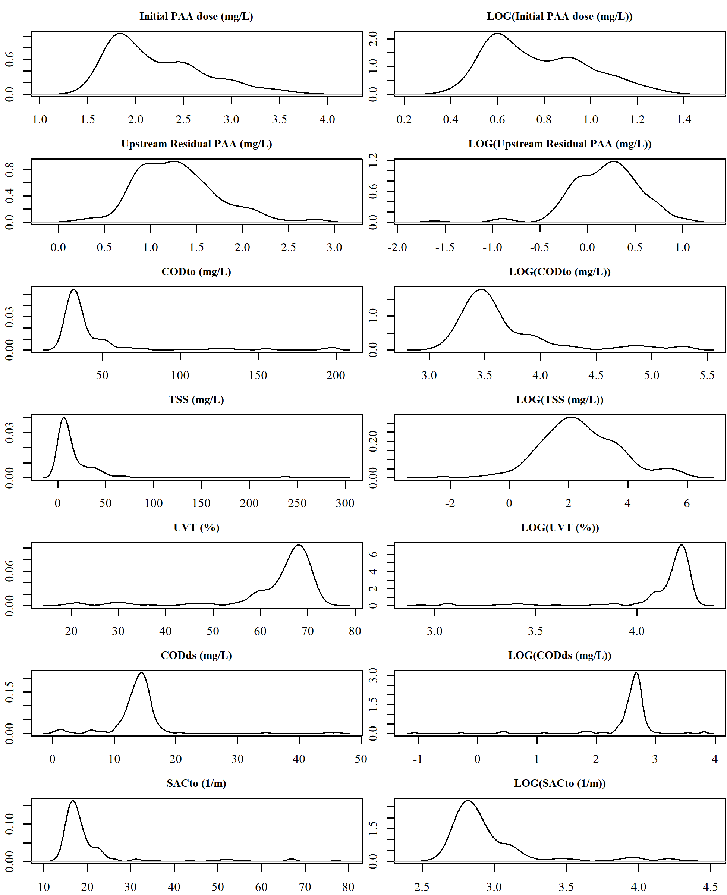
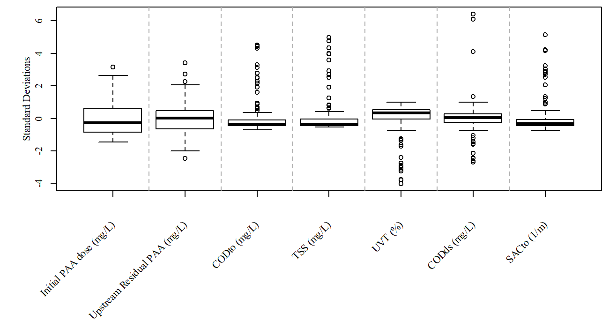

```{r Preliminary declarations, message=FALSE, warning=FALSE, include=FALSE, paged.print=FALSE}
rm(list=ls())

# Load required packages
packageLoad <- function(packName){ #packName - package name as a character string, e.g. "quantmod"
  if(!require(packName,character.only = TRUE)){ #If the package is not available, install it
    install.packages(packName,dependencies=TRUE,repos="http://cran.r-project.org")
  }
  library(packName, character.only = TRUE) # load package
}

sapply(c("knitr", "readxl", "xts", "visreg", "mgcv", "factoextra", "pls", "plsdepot", "ggplot2", "randomForest", "e1071"), function(x) packageLoad(x))

# User-defined functions
PIdataImport <- function(fileLocation = "data/PIdata.xlsx") {
  PIdata <- readxl::read_excel(fileLocation, skip = 1)
  n <- ncol(PIdata)/2 # n = number of datasets to import
  for (i in 1:n) {
    remove.nas <- which(is.na(PIdata[,(i*2-1)]))
    if (length(remove.nas) == 0) {
          PIdata.sub <- xts::xts(PIdata[,(i*2)], order.by = as.POSIXct(data.frame(PIdata[,(i*2-1)])[[1]], format = "%Y-%m-%d %H:%M:%S"))
    } else {
          PIdata.sub <- xts::xts(PIdata[-remove.nas,(i*2)], order.by = as.POSIXct(data.frame(PIdata[-remove.nas,(i*2-1)])[[1]], format = "%Y-%m-%d %H:%M:%S"))
    }
    names(PIdata.sub) <- stringr::str_replace_all(names(PIdata.sub), c(" " = "." , "-" = "" ))
    assign(as.character(names(PIdata.sub)), PIdata.sub, envir = .GlobalEnv)
    if (i == 1) {
      new.objects <- as.character(names(PIdata.sub))
    } else {
      new.objects <- c(new.objects, as.character(names(PIdata.sub)))
    }
  }
  return(new.objects)
}
```

```{r Plot functions, message=FALSE, warning=FALSE, include=FALSE, paged.print=FALSE}
default.par <- par()
windowsFonts(A = windowsFont("Times New Roman"))

scaled.boxplot.png <- function(data, filename, lines = seq(round(ncol(data)/5),ncol(data)-1, by = round(ncol(data)/5)) + .5, margins = c(9,3.5,0.5,0.5)+.1) {
  labs <- colnames(data)
  windowsFonts(A = windowsFont("Times New Roman"))
  png(filename, units = "in", res = 200, width = 6.5, height = 3.5, family="A", pointsize = 8)
  par(mar = margins)
  boxplot.data <- sapply(data.frame(data), function(x) scale(na.omit(x)))
  boxplot(boxplot.data, xaxt="n", xlab="")
  axis(1,at=seq(1,length(boxplot.data),by =1), labels = FALSE)
  mtext("Standard Deviations", side = 2, line = 2)
  text(x=seq_along(labs), y=par("usr")[3] - 2, srt=45, adj = 1, labels= labs, xpd=TRUE)
  abline(v=lines, lty = 2,col = "darkgrey")
  dev.off()
  suppressWarnings(par(default.par))
}

plotTimeseries <- function(data1) {

label1 <- colnames(data1)

r1 <- range(index(data1)[which(!is.na(data1))])[1]
r2 <- range(index(data1)[which(!is.na(data1))])[2]

data2plot <- na.omit(data1)[paste0(r1,"/",r2)]
data2plot <- data.frame(data2plot, row.names = as.character(index(data2plot)))
data2plot <- cbind(data2plot, as.numeric(difftime(as.POSIXct(rownames(data2plot)), as.POSIXct(rownames(data2plot)[1]),units = "days")))

par(mar=c(3.1,4.1,2.1,2.1))
plot(x = data2plot[,ncol(data2plot)], y = data2plot[,1], type = "p", pch = 20, col = "black", xaxt = "n", xlab = "", ylab = "", yaxt="n")
axis(side = 2)
mtext(side = 2, label1, line = 2.5)

# x-axis
axis.ticks <- seq(0,round(data2plot[nrow(data2plot),ncol(data2plot)]), by = 10)
axis.labels <- sapply(axis.ticks, function(x) which(x > data2plot[,ncol(data2plot)]))
axis.labels <- sapply(axis.labels, function(x) x[length(x)])
axis.labels[[1]] <- 1
axis.labels <- as.numeric(unlist(axis.labels))
axis(side = 1, at = axis.ticks, labels = format(as.POSIXct(rownames(data2plot)[axis.labels]), "%m/%d"))
}

plotTwo <- function(data1,data2) {
# data1 <- log(n.paa.grab[,6]) 
# data2 <- nsec.online[,which(colnames(nsec.online) == "NSEC Effluent NO5")]

label1 <- colnames(data1)
label2 <- colnames(data2)

if (range(index(data1)[which(!is.na(data1))])[1] < range(index(data2)[which(!is.na(data2))])[1]) {
  r1 <- range(index(data2)[which(!is.na(data2))])[1]
} else {
  r1 <- range(index(data1)[which(!is.na(data1))])[1]
}
if (range(index(data1)[which(!is.na(data1))])[2] > range(index(data2)[which(!is.na(data2))])[2]) {
  r2 <- range(index(data2)[which(!is.na(data2))])[2]
} else {
  r2 <- range(index(data1)[which(!is.na(data1))])[2]
}

data2plot <- na.omit(data1)[paste0(r1,"/",r2)]
data2plot <- merge(data2plot, data2[paste0(r1,"/",r2)])
data2plot <- data2plot[-which(duplicated(index(data2plot))),]
data2plot <- data.frame(data2plot, row.names = as.character(index(data2plot)))
data2plot <- cbind(data2plot, as.numeric(difftime(as.POSIXct(rownames(data2plot)), as.POSIXct(rownames(data2plot)[1]),units = "days")))

par(mar=c(5.1,4.1,2.1,4.1))
plot(x = data2plot[,3], y = data2plot[,1], type = "p", pch = 20, col = "black", xaxt = "n", xlab = "", ylab = "", yaxt="n")
axis(side = 2)
mtext(side = 2, label1, line = 2.5)

par(new = TRUE)
plot(x = data2plot[,3], y = data2plot[,2], type = "p", pch = 20, col = "red", xaxt = "n", xlab = "", yaxt="n", ylab = "")
axis(side = 4, col.axis = "red")
mtext(side = 4, label2, line = 2.5, col = "red")
# x-axis
axis.ticks <- seq(0,round(data2plot[nrow(data2plot),3]), by = 10)
axis.labels <- sapply(axis.ticks, function(x) which(x > data2plot[,3]))
axis.labels <- sapply(axis.labels, function(x) x[length(x)])
axis.labels[[1]] <- 1
axis.labels <- as.numeric(unlist(axis.labels))
axis(side = 1, at = axis.ticks, labels = format(as.POSIXct(rownames(data2plot)[axis.labels]), "%m/%d"))
}
```

# Introduction
Previous analyses (version 1, 2019-03-28) demonstrated no substantial link between *E. coli* concentrations entering the PAA disinfection system and other effluent water quality parameters measured online in the North Secondary system. 

In this document, online water quality parameters are used to predict PAA residual immediately post-dosing (i.e., "upstream residual"). The initial PAA concentration is calculated based on a flow-mass balance from the PAA dosing pump rate and influent disinfection basin flowrate. 

Similar to previous analysis, very few of the measured water quality variables at the PAA dosing point (residual PAA, COD, TSS, UVT, and SAC) exhibit a normal distribution (**Figure S1**). This will be a source of error in many statistical methods. To minimize this error, a log transform of all variables was performed to better approximate a normal distribution (**Figure S1**). However, there limited improvement of the log transform in the distribution of each variable due to the highly skewed nature of the data (**Figure 1**). In future iterations of data analysis will include calculating the skewness and exploring additional transformations to account for the wide range of values for each process variable, or narrowing the range of values for each process variable to approximate a normal distribution.

<!-- V1 -->
```{r NPAA Grab, message=FALSE, warning=FALSE, include=FALSE, paged.print=FALSE}
## North disinfection - grab
delta <- intToUtf8(0x0394)
# Daily data
process.data <- read_excel("data/Copy of PAA Process Data Clean KN.xlsx", 
    sheet = "Process Data", skip = 1)
process.data <- process.data[-1,]
n.paa.grab <- xts(apply(process.data[,c(12:17,19:27)], 2, function(x) as.numeric(x)), order.by =  as.POSIXct(as.data.frame(process.data[,18])[,1], format = "%Y-%m-%d %H:%M:%S"))
colnames(n.paa.grab) <- c("PAA Dosing Pump Total Flow (gpm)", #1 
                                  "PAA Dose (mg/L)", #2
                                  "PAA Setpoint (mg/L)", #3 
                                  "Upstream  Residual (mg/L)", #4 
                                  paste0(delta,"PAA (mg/L)"),	#5
                                  "Pre-Disinfection E. coli (MPN/100 mL)",  #6
                                  "Effluent Discharge (MGD)", #7
                                  "Contact Tank Volume (MG)", #8
                                  "Detention Time (min)", #9
                                  "Time to Upstream Sample Point (min)", #10
                                  "Log Removal (N0/N)", #11
                                  "Effluent E. coli (MPN/100 mL)", #12
                                  "CT (mg/L*min)", #13
                                  "CuT (mg/L*min)", #14
                                  "Ambient Temperature")#15
rm(process.data)

# scaled.boxplot.png(n.paa.grab, "figures/MWRD_npaa_grab_boxplots_01.png", margins = c(12,6.5,0.5,0.5)+.1)

n.paa.grab <- n.paa.grab["2018-06-01/2018-12-01"]
n.paa.grab <- n.paa.grab[-which(n.paa.grab[,4] > 4),] # Remove high PAA residuals

data2plot <- n.paa.grab
data2plot[,6] <- log(data2plot[,6])
colnames(data2plot)[6] <- paste("LOG",colnames(data2plot)[6])
data2plot[,12] <- log(data2plot[,12])
colnames(data2plot)[12] <- paste("LOG",colnames(data2plot)[12])
sapply(data2plot, function(x) plot.xts(na.omit(x), main = colnames(x), grid.col = NA, yaxis.right = FALSE, format.labels ="%m/%d"))

# par(default.par)
# plot.xts(data2plot[,c(6,12)], type = "p", pch = 20, cex = 0.8,  col = c("black", "red"), grid.col = NA, main = NA, yaxis.right = FALSE, legend.loc = "bottomleft", format.labels ="%m/%d", minor.ticks = NULL)

# scaled.boxplot.png(n.paa.grab, "figures/MWRD_npaa_grab_boxplots_02.png", margins = c(12,6.5,0.5,0.5)+.1)
# Create boxplots
# scaled.boxplot.png(n.paa.grab, "figures/MWRD_npaa_grab_boxplots.png", margins = c(12,6.5,0.5,0.5)+.1)
```

<!-- V2 -->
```{r Vis/PAA, message=FALSE, warning=FALSE, include=FALSE, paged.print=FALSE}
# Add Vis data?
vis.data <- read_excel("data/NNE Carbovis Data2.xlsx",
    sheet = "Inst DL Data", col_types = c("date",
        "text", "numeric", "skip", "skip",
        "skip", "numeric", "skip", "skip",
        "skip", "numeric", "skip", "skip",
        "skip", "numeric", "skip", "skip",
        "skip", "numeric", "skip", "skip",
        "skip", "numeric", "skip", "skip",
        "skip", "skip", "numeric", "skip",
        "skip", "skip", "numeric", "skip",
        "skip", "skip", "skip", "numeric",
        "skip", "skip", "skip", "numeric",
        "skip"), skip = 6)
vis.data <- vis.data[which(vis.data[,2] == "Valid"),-2]
colnames(vis.data) <- c("Time", "CODto (mg/L)", "CODto (V)",
                        "TSS (mg/L)", "TSS (V)",
                        "UVT (%)", "UVT (V)",
                        "CODds (mg/L)", "CODds (V)",
                        "SACto (1/m)", "SACto (V)")
vis.data <- xts(vis.data[,-1], order.by = as.POSIXct(as.data.frame(vis.data[,1])[,1], format = "%Y-%m-%d %H-%M-%S"))

vis.data <- vis.data[-which(vis.data$`CODds (mg/L` == 0),] # Remove sensor error
vis.data <- vis.data[-which(vis.data$`CODto (mg/L` > 200),] # Remove bad COD data


data1 <- vis.data
data2 <- n.paa.grab[,c(2,4)] # PAA dose (calculated), Upstream residual

label1 <- colnames(data1)
label2 <- colnames(data2)

all.data <- merge(data2, data1)
all.data.index <- which(!is.na(all.data[,1]))
for(i in 1:(length(all.data.index)-1)) {
    row.start <- all.data.index[i]
    row.stop <- all.data.index[i+1]
    data.locf <- na.locf(all.data[(row.start+1):row.stop,])
    if (i == 1) {
        new.data <- data.frame(data.locf[nrow(data.locf),])
    }
    if (i != 1) {
        new.data <- rbind(new.data, data.frame(data.locf[nrow(data.locf),]))
    }
}
#new.data <- new.data[which(!is.na(new.data[,2])),-which(is.na(new.data[1,]))]
new.data <- na.omit(new.data)
new.data <- new.data[-which(is.na(as.POSIXct(rownames(new.data), format = "%Y-%m-%d %H:%M:%S"))),]

vis.paa.data <- xts(new.data, order.by = as.POSIXct(rownames(new.data), format = "%Y-%m-%d %H:%M:%S"))

colnames(vis.paa.data) <- c("Initial PAA dose (mg/L)", "Upstream Residual PAA (mg/L)", "CODto (mg/L)", "CODto (V)",
                        "TSS (mg/L)", "TSS (V)",
                        "UVT (%)", "UVT (V)",
                        "CODds (mg/L)", "CODds (V)",
                        "SACto (1/m)", "SACto (V)")

cols2remove <- c("CODto (V)","TSS (V)","UVT (V)","CODds (V)","SACto (V)")

cols2remove <- sapply(cols2remove, function(x) which(colnames(vis.paa.data) == x))
vis.paa.data <- vis.paa.data[,-cols2remove]


scaled.boxplot.png(vis.paa.data, "figures/MWRD_paa_vis_boxplots.png", margins = c(11,4.5,0.5,0.5)+.1)

# Log transform data
vis.paa.data.log <- log(vis.paa.data)
scaled.boxplot.png(vis.paa.data.log, "figures/MWRD_paa_vis_boxplots_log.png", margins = c(11,4.5,0.5,0.5)+.1)

# Kernel density
png("figures/MWRD_paa_vis_density.png", units = "in", res=300, width = 6.5, height = 8)
par(mfcol=c(ncol(vis.paa.data),2), mar=c(2.1,2.1,2.1,.1), cex.main = 0.9)
sapply(vis.paa.data, function(x) plot(density(x), main = colnames(x), xlab = "", ylab = "", family = "A"))
sapply(vis.paa.data.log, function(x) plot(density(x), main = paste0("LOG(",colnames(x),")"), xlab = "", ylab = "", family = "A"))
dev.off()
```

```{r GVT TSS, message=FALSE, warning=FALSE, include=FALSE, paged.print=FALSE}
PIdataImport(fileLocation = "data/PIdata - GVT TSS.xlsx") 

data1 <- xts(GVT2.TSS, order.by = lubridate::force_tz(index(GVT2.TSS), "UTC"))
data2 <- xts(vis.paa.data, order.by = lubridate::force_tz(index(vis.paa.data), "UTC"))

label1 <- colnames(data1)
label2 <- colnames(data2)

all.data <- merge(data2, data1)
all.data.index <- which(!is.na(all.data[,1]))
for(i in 1:(length(all.data.index)-1)) {
    row.start <- all.data.index[i]
    row.stop <- all.data.index[i+1]
    data.locf <- na.locf(all.data[(row.start+1):row.stop,])
    if (i == 1) {
        new.data <- data.frame(data.locf[nrow(data.locf),])
    }
    if (i != 1) {
        new.data <- rbind(new.data, data.frame(data.locf[nrow(data.locf),]))
    }
}
new.data <- na.omit(new.data)

vis.paa.gvt.data <- xts(new.data, order.by = as.POSIXct(rownames(new.data), format = "%Y-%m-%d %H:%M:%S"))


data1 <- xts(GVT4.TSS, order.by = lubridate::force_tz(index(GVT4.TSS), "UTC"))
data2 <- xts(vis.paa.gvt.data, order.by = lubridate::force_tz(index(vis.paa.gvt.data), "UTC"))

label1 <- colnames(data1)
label2 <- colnames(data2)

all.data <- merge(data2, data1)
all.data.index <- which(!is.na(all.data[,1]))
for(i in 1:(length(all.data.index)-1)) {
    row.start <- all.data.index[i]
    row.stop <- all.data.index[i+1]
    data.locf <- na.locf(all.data[(row.start+1):row.stop,])
    if (i == 1) {
        new.data <- data.frame(data.locf[nrow(data.locf),])
    }
    if (i != 1) {
        new.data <- rbind(new.data, data.frame(data.locf[nrow(data.locf),]))
    }
}
new.data <- na.omit(new.data)

vis.paa.gvt.data <- xts(new.data, order.by = as.POSIXct(rownames(new.data), format = "%Y-%m-%d %H:%M:%S"))
```

```{r NSEC MLR, message=FALSE, warning=FALSE, include=FALSE, paged.print=FALSE}
mlr.objects <- PIdataImport(fileLocation = "data/PIdata - NSEC MLR.xlsx") 

data1 <- xts(NSEC.Quad.4.MLR.SVI, order.by = lubridate::force_tz(index(NSEC.Quad.4.MLR.SVI), "UTC"))
data2 <- xts(vis.paa.data, order.by = lubridate::force_tz(index(vis.paa.data), "UTC"))

label1 <- colnames(data1)
label2 <- colnames(data2)

all.data <- merge(data2, data1)
all.data.index <- which(!is.na(all.data[,1]))
for(i in 1:(length(all.data.index)-1)) {
    row.start <- all.data.index[i]
    row.stop <- all.data.index[i+1]
    data.locf <- na.locf(all.data[(row.start+1):row.stop,])
    if (i == 1) {
        new.data <- data.frame(data.locf[nrow(data.locf),])
    }
    if (i != 1) {
        new.data <- rbind(new.data, data.frame(data.locf[nrow(data.locf),]))
    }
}
new.data <- na.omit(new.data)

vis.paa.mlr.data <- xts(new.data, order.by = as.POSIXct(rownames(new.data), format = "%Y-%m-%d %H:%M:%S"))


data1 <- xts(NSEC.Quad.4.MLR.TSS, order.by = lubridate::force_tz(index(NSEC.Quad.4.MLR.TSS), "UTC"))
data2 <- xts(vis.paa.mlr.data, order.by = lubridate::force_tz(index(vis.paa.mlr.data), "UTC"))

label1 <- colnames(data1)
label2 <- colnames(data2)

all.data <- merge(data2, data1)
all.data.index <- which(!is.na(all.data[,1]))
for(i in 1:(length(all.data.index)-1)) {
    row.start <- all.data.index[i]
    row.stop <- all.data.index[i+1]
    data.locf <- na.locf(all.data[(row.start+1):row.stop,])
    if (i == 1) {
        new.data <- data.frame(data.locf[nrow(data.locf),])
    }
    if (i != 1) {
        new.data <- rbind(new.data, data.frame(data.locf[nrow(data.locf),]))
    }
}
new.data <- na.omit(new.data)

vis.paa.mlr.data <- xts(new.data, order.by = as.POSIXct(rownames(new.data), format = "%Y-%m-%d %H:%M:%S"))
```

<div custom-style="FigureCenter">

</div>

**Figure 1.** Kernel density plots of actual and log transformed online PAA data and Carbovis data. The vertical axis is frequency (i.e., density) of observations and the horizontal axis is the value of the observations. 


# Methods

## Linear regression

<!-- V2 -->
```{r message=FALSE, warning=FALSE, include=FALSE, paged.print=FALSE}
data <- data.frame(vis.paa.data)
lm <- lm(Upstream.Residual.PAA..mg.L. ~ Initial.PAA.dose..mg.L.,data = data)

xmax <- 3
ymin <- 1
png("figures/MWRD_residual_paa_lm.png", units = "in", res = 200, width = 3, height = 3, family="A", pointsize = 10)
par(mar=c(3,3,.5,.5), mgp=c(1.75,.5,0))
plot(x = data[,2], y = fitted(lm), 
     xlim=c(ymin,xmax), ylim=c(ymin,xmax),
     xlab="Actal Residual PAA (mg/L)", ylab="Predicted Residual PAA ~ Initial PAA", pch=20)
abline(a=0,b=1,col="blue", lwd=2)
text(xmax,y=ymin,labels=round(summary.lm(lm)$r.squared,2), font=2, adj = 1)
text(x=ymin,y=xmax,labels="(a)", font=2)
dev.off()


data <- data.frame(vis.paa.data)
fmla <- as.formula(paste0(colnames(data)[2],"~", paste(colnames(data)[c(1,3:length(colnames(data)))], collapse= "+"))) # All variables
fmla <- as.formula(paste0(colnames(data)[2],"~", paste(c("Initial.PAA.dose..mg.L.","UVT....","CODds..mg.L."), collapse= "+"))) # Just sig vars
lm <- lm(fmla, data = data)

xmax <- 3
ymin <- 1
png("figures/MWRD_residual_lm.png", units = "in", res = 200, width = 3, height = 3, family="A", pointsize = 10)
par(mar=c(3,3,.5,.5), mgp=c(1.75,.5,0))
plot(x = data[,2], y = fitted(lm), 
     xlim=c(ymin,xmax), ylim=c(ymin,xmax),
     xlab="Actal Residual PAA (mg/L)", ylab="Predicted Residual ~ Initial PAA + UVT + CODds", pch=20)
abline(a=0,b=1,col="blue", lwd=2)
text(xmax,y=ymin,labels=round(summary.lm(lm)$r.squared,2), font=2, adj = 1)
text(x=ymin,y=xmax,labels="(b)", font=2)
dev.off()


# Log transform
data <- data.frame(vis.paa.data.log)
lm <- lm(Upstream.Residual.PAA..mg.L. ~ Initial.PAA.dose..mg.L.,data = data)

xmax <- max(data[,2])
ymin <- min(fitted(lm))
png("figures/MWRD_residual_paa_log_lm.png", units = "in", res = 200, width = 3, height = 3, family="A", pointsize = 10)
par(mar=c(3,3,.5,.5), mgp=c(1.75,.5,0))
plot(x = data[,2], y = fitted(lm), 
     xlim=c(ymin,xmax), ylim=c(ymin,xmax),
     xlab="Actal Log Residual PAA (mg/L)", ylab="Predicted Log Residual PAA ~ Log Initial PAA", pch=20)
abline(a=0,b=1,col="blue", lwd=2)
text(xmax,y=ymin,labels=round(summary.lm(lm)$r.squared,2), font=2, adj = 1)
text(x=ymin,y=xmax,labels="(a)", font=2)
dev.off()
a <- round(summary.lm(lm)$r.squared,2)

# MLR TSS & SVI
data <- data.frame(vis.paa.mlr.data)
fmla <- as.formula(paste0(colnames(data)[2],"~", paste(colnames(data)[c(1,3:length(colnames(data)))], collapse= "+"))) # All variables
# fmla <- as.formula(paste0(colnames(data)[2],"~", paste(c("Initial.PAA.dose..mg.L.","UVT....","CODds..mg.L."), collapse= "+"))) # Just sig vars
lm <- lm(fmla, data = data)

xmax <- max(data[,2])
ymin <- min(fitted(lm))
png("figures/MWRD_residual_mlr_lm.png", units = "in", res = 200, width = 3, height = 3, family="A", pointsize = 10)
par(mar=c(3,3,.5,.5), mgp=c(1.75,.5,0))
plot(x = data[,2], y = fitted(lm), 
     xlim=c(ymin,xmax), ylim=c(ymin,xmax),
     xlab="Actal Residual PAA (mg/L)", ylab="Predicted Residual ~ CarboVis + MLR TSS + SVI", pch=20)
abline(a=0,b=1,col="blue", lwd=2)
text(xmax,y=ymin,labels=round(summary.lm(lm)$r.squared,2), font=2, adj = 1)
text(x=ymin,y=xmax,labels="(b)", font=2)
dev.off()
b <- round(summary.lm(lm)$r.squared,2)


# No improvement with GVT2 & GVT4 TSS data
data <- data.frame(vis.paa.data)
fmla <- as.formula(paste0(colnames(data)[2],"~", paste(colnames(data)[c(1,3:length(colnames(data)))], collapse= "+"))) # All variables
lm <- lm(fmla, data = data)
round(summary.lm(lm)$r.squared,2)

data <- data.frame(vis.paa.gvt.data)
fmla <- as.formula(paste0(colnames(data)[2],"~", paste(colnames(data)[c(1,3:length(colnames(data)))], collapse= "+"))) # All variables
lm <- lm(fmla, data = data)
round(summary.lm(lm)$r.squared,2)
```


In a general linear model (LM), a model is constructed of a response variable (**Y**) that is a linear function of other variables (*x~i~*). The LM assumes that **Y** is normally distributed, errors are normally distributed and independent, and **X** has constant variance. 

**Figure 2** shows a strong relationship between initial PAA dose and the upstream residual, but linear impacts of other online water quality variables are minimal. Ambient temperature, gravity thickener (GVT) 2 and 4 were included in the LM, but did not improve model fit. Log transformed variables performed substanically worse  (from **Figure 2**, scenerio (a) r^2^ = `r a`). LM fit was improved with the addition of North Secondary Quad 4 mixed liquor return (MLR) SVI and TSS. 

<div custom-style="FigureCenter">


</div>
**Figure 2.** Linear model fit for upstream residual PAA given (a) the initial dosing concentration of PAA and (b) all variables. Black circles represent actual observations. Blue line represents a perfect model fit. R-squared value in lower right. 


## Generalized Linear Model
The LM requires that the response variable follows the normal distribution whilst the generalized linear model (GLM) is an extension of the LM that allows the specification of models whose response variable follows different distributions. 
No difference was found between a LM fit with the initial calculated PAA dose, UVT, and CODds and a GLM fit with the same predictor variables. 

<!-- V2 -->
```{r GLM, eval=FALSE, message=FALSE, warning=FALSE, include=FALSE, paged.print=FALSE}
data <- data.frame(vis.paa.data)
# fmla <- as.formula(paste0(colnames(data)[2],"~", paste(colnames(data)[c(1,3:length(colnames(data)))], collapse= "+")))
fmla <- as.formula(paste0(colnames(data[2]),"~", paste(c("Initial.PAA.dose..mg.L.", "UVT....", "CODds..mg.L."), collapse="+")))
glm.vis.paa.data <- glm(fmla, data=data)

png("figures/MWRD_residual_vis_glm.png", units = "in", res = 200, width = 6.5, height = 2.5, family="A", pointsize = 10)
par(mar=c(5,5,.5,.5), mfrow=c(1, 3))
visreg::visreg(glm.vis.paa.data, "Initial.PAA.dose..mg.L.", ylab="Upstream Residual PAA (mg/L)", xlab = "Initial PAA dose (mg/L)")
visreg::visreg(glm.vis.paa.data, "UVT....", ylab="Upstream Residual PAA (mg/L)", xlab = "UVT (%)")
visreg::visreg(glm.vis.paa.data, "CODds..mg.L.", ylab="Upstream Residual PAA (mg/L)", xlab = "CODds (mg/L)")
dev.off()

xmax <- 3
ymin <- 1
png("figures/MWRD_residual_glm.png", units = "in", res = 200, width = 3, height = 3, family="A", pointsize = 10)
par(mar=c(3,3,.5,.5), mgp=c(1.75,.5,0))
plot(x = data[,2], y = glm.vis.paa.data$fitted.values, 
     xlim=c(ymin,xmax), ylim=c(ymin,xmax),
     xlab="Actal Residual PAA (mg/L)", ylab="Predicted Residual ~ Initial PAA + UVT + CODds", pch=20)
abline(a=0,b=1,col="blue", lwd=2)
# text(xmax,y=ymin,labels=round(summary.lm(lm)$r.squared,2), font=2, adj = 1)
# text(x=ymin,y=xmax,labels="(b)", font=2)
dev.off()
```

```{r GLM, message=FALSE, warning=FALSE, include=FALSE, paged.print=FALSE}
data <- data.frame(vis.paa.mlr.data)
fmla <- as.formula(paste0(colnames(data)[2],"~", paste(colnames(data)[c(1,3:length(colnames(data)))], collapse= "+")))
glm.vis.paa.data <- glm(fmla, data=data)

png("figures/MWRD_residual_vis_mlr_glm.png", units = "in", res = 200, width = 6.5, height = 2*2.5, family="A", pointsize = 10)
par(mar=c(5,5,.5,.5), mfrow=c(4,2))
visreg::visreg(glm.vis.paa.data, ylab=colnames(data)[2])
dev.off()
```
<div custom-style="FigureCenter">

</div>
**Figure 3.** GLM model constructed for upstream residual PAA concentration (mg/L) calculated from initial calculated PAA dose, UVT, and CODds.


## Non-Regression Model
```{r Random Forest and SVM, message=FALSE, warning=FALSE, include=FALSE, paged.print=FALSE}
par(default.par)
# 
# rf.nsec.online.ecoli <- randomForest::randomForest(Pre.disinf.E..coli..LOG.MPN.100mL. ~ NSEC.Aerobic.SRT + NSEC.Effluent.OP + NSEC.Effluent.NO3 + NSEC.Effluent.NO5 + NSEC.Effluent.Flow, data=data.frame(nsec.online.ecoli.data))

data <- data.frame(vis.paa.data)
fmla <- as.formula(paste0(colnames(data)[2],"~", paste(colnames(data)[c(1,3:length(colnames(data)))], collapse= "+")))
svm.test <- e1071::svm(fmla, data = data)

png("figures/MWRD_residual_svm.png", units = "in", res = 200, width = 3, height = 3, family="A", pointsize = 8)
par(mfrow=c(1,1), mar=c(4.5,4,.5,2))

visreg(fit=svm.test, xvar="Initial.PAA.dose..mg.L.", plot=TRUE, xlab = "Initial PAA dose (mg/L)", ylab = "Upstream Residual PAA (mg/L)", points.par=c(col="black"), line.par=c(col="blue"))
dev.off()

```
<div custom-style="FigureCenter">

</div>

**Figure 4.** Nonregression model (support vector machine) for predicting upstream residual PAA shows a nonlinear behavior

# Supplementary Material
## Figures
<div custom-style="FigureCenter">

</div>

**Figure S1.** Scaled boxplot of online PAA data and Carbovis data. 

<div custom-style="FigureCenter">

</div>

**Figure S2.** Scaled boxplot of log transformed online PAA data and Carbovis data. 
